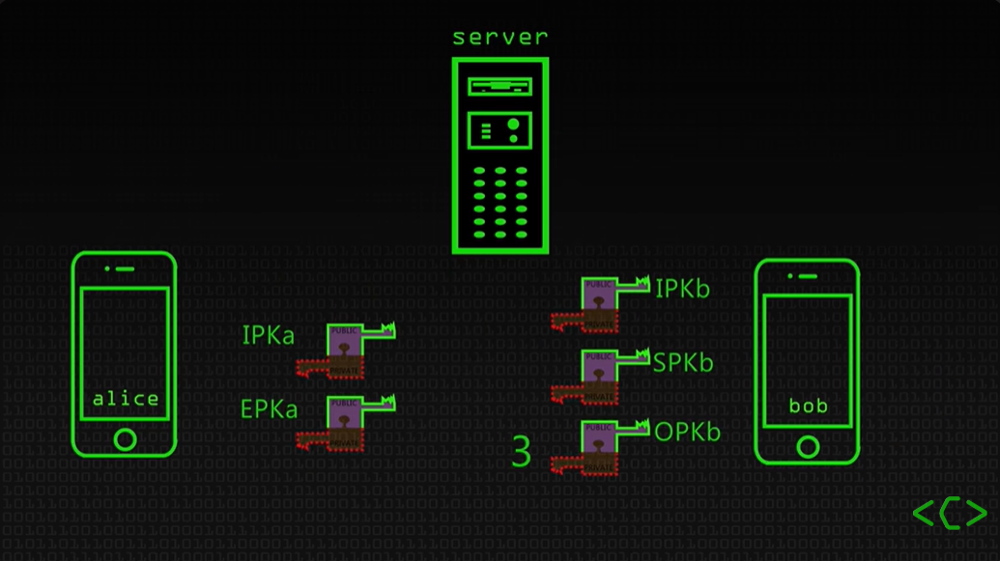
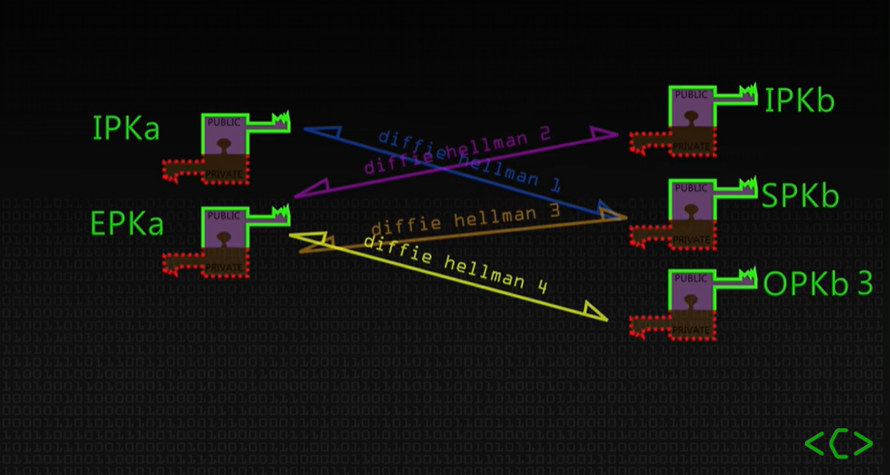

# Case 1

In March 2025 a security incident occurred within the U.S. administration. Several high-ranking U.S. officials discussed detailed imminent military operations, including specific information about airstrikes (e.g. timing) over regular personal communication devices in a group chat on the Signal messaging app. Furthermore, a journalist was invited by mistake into the group chat.

The information discussed was classified information, that might have endangered the security of the aircraft pilots if it had been revealed to hostile forces.

**Explain which security services would be essential for such a discussion about classified information. Which security services might have been breached in this incident? What improvements would you suggest to the approach that had been chosen during this incident?**

## Answer

### Some background info
To ensure security for a discussion about classified information two main aspects should be taken into account:
1. Devices that have access to this discussion should be protected.
2. Application's transmission should be protected. 

**Instant Messaging Protocol** 
- Only server knows where parties are. Alice does not know where Bob is and if he is able to communicate at a certain time (et vice versa).
- Bob sends his Identity Public Key (IPK_b) to server and signs a public key (SPK_b) to verify that he is in control.
- Bob sends some Public keys beforehand to the server (OPK_b1, OPK_b2, ...). 
- When Alice wants to communicate with Bob, she asks for a pre-key bundle. 
- Server replies with IPK_b, SPK_b and one random other (e.g. OPK_b3).
- Alice generates IPK_a and an epherimal key (EPK_a) which is a one use session key. 
- Current setup:

    * IPK_b: Ensures Bob is on the other line (identification/authentication).
    * SPK_b: Stops the server messing with Bob's prekeys.
    * OPK_b3: Stops replay attacks (gets deleted after Bob has seen it for the first time).
    * IPK_a
    * EPK_a
- Alice performs 4 Diffie-Hellman key exchanges (using ECC).
 
- Alice makes a "master" session key with a Key Derivation Function to combine the 4 exchanges.
- Alice sends a message with something encrypted (with master key) together with IPK_a and EPK_a. 
- Bob does the same procedure to send a message back.
- Every single message uses a different key!

### Essential Security Services
1. **Confidentiality**: Information is only visible if you are authorised. 
2. **Information Integrity**: No one has altered the information.
3. **Availability**: Information should be accessible at all time. 
4. **Authentication and Access Control**: Everyone is who he claims to be and no outsider has unauthorised access. 
5. **Non-repudiation**: Participants cannot deny their involvement in a communication.
6. **Audit and Accountability**: Legal and tamper-proof communication logs should be available. 

### Breached? 
- **Information Integrity**: IPK have to be verified by the other party. Signal performs a hash function to combine IPK of both parties to form a safety number. Verification happens "out-of-band" which means keys are verified offline (without using the normal encryption).
If the safety numbers are not checked, a MitM attack could have been done without anyone knowing it even happened. In a group, this remains pairswise, leading to bigger attack surface. 
- **Confidentiality/Access Control**: 
  * Someone (journalist) got unauthorised access.
  * Single Point of Trust: Someone at Signal could have malicious intents or Signal could get compromised.
  * Allthough Signal uses a strong end-to-end encryption, a large network attack could be launched on a specific device, taking full control of it. This would make this encryption pointless.
- **Authentication**: No verification was needed to add someone to the group chat.
- **Audit and Accountability**: Signal uses strong E2EE so the server does not see the content of the sent messages and cannot provide audit logs.
- **Non-repudiation**: No audit logs and signal also supports "disappearing messages" which destroys the evidence. 

### Improvements
- Use a non-public application for classied information. Use an approved private application, which uses legal compliant and tamper-proof audit logs. 
- Provide an extra (multi-factor) verification before joining a certain conversation/group.
- Make sure well encrypted (and not personal) systems are used for communication.

### Sources
- <https://www.youtube.com/watch?v=PD9_djWnkgQ>
- <https://www.youtube.com/watch?v=DXv1boalsDI>
- <https://www.youtube.com/watch?v=9sO2qdTci-s> --> Quite advanced and not in scope of this question (I think)...
- Claude-AI for further insights.  
  
_Status: Complete?_  
_Done by: Hann1bal20_