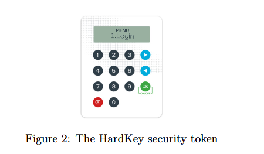

# Case 25



You have a so-called HardKey, which is a security token (without card reader, but with a small display, see also Fig. 2) without physical contact³ to the host, allowing you to log in to your bank web site. You see the following instructions on your Web browser:

1. Enter your username then click on "next step" (both on the web site)
2. Get your HardKey and press the OK button to switch it on
3. When your see "1.Login" press the OK button
4. Enter your PIN on your HardKey and press the OK button
5. Enter the (8 decimal digit) code displayed on your HardKey (on the web site)

**How might such a system work (which cryptographic algorithms, which key sizes, which input, etc.)?**

**How vulnerable is this procedure to malware on the user's host?**

*Note: I expect you to make a choice and to defend this choice. Don't present a range of possible solutions.*

A few additional notes:

- The website itself is protected using TLS 1.3 (certificate for 2048 bit RSA public key; The connection is encrypted using AES_128_GCM, SHA-2-256 is the hash function for HMAC, ECDHE is used for the key exchange mechanism, and RSA is used in the server authentication of the handshake).
- If you repeat the procedure with the same input on the token, you'll obtain a different 8 digit code, which will also be accepted by the website
- After a few minutes, the original 8 digit code will no longer be accepted
- If you attempt to input five erroneous 8 digit codes, your contract will be blocked
- If you enter a wrong PIN three times in a row on the token, your token will be blocked. To unblock your token, you'll need to contact the bank, which can reset it

³ *This means it cannot receive data from your computer or send data to your computer. You can manually input data usind the keypad of the token and the output of the token can be read on its (small) display.*

## Answer

Based on the question a few assumtions have been made:
- Since TLS 1.3 is already used, the communication channel is already protected. The HardKey mainly serves as a second authentication factor.
- When the pin is entered wrong 3 times, it should not break the HardKey but block it in a way this can be reactivated by the bank.
- The HardKey uses secure hardware, meaning it's not easy to tamper with the memory.
- The bank stores every user's key $K$ along with their username and the failed authentication counter.
- Timestamps $T$ are rounded to a set amount of time (e.g. every 15 seconds).

We also know the 8-digit code should change with consecutive generations and it should expire after some set time. Taking this into account the problem starts to look like a TOTP (Time-Based One-Time Password Algorithm, rfc6238).

To implement this, every HardKey should have a 256-bit secret key $K$ (long lived key).When a user wants to log in and enters the correct pin, this key and the current time stamp $T$ are processed using HMAC-sha256 after which the resulting value is truncated to an 8-digit code. 
$$
\text{8-digit code} = \text{HMAC-sha256}(\text{K}, \text{T})\ \text{mod}\ 10^8
$$

The user then sends this 8-digit code to the bank which computes the expected codes for the current and neighboring time windows to account for small clock drift. These codes are then compared against the received code. If one of the codes matches, the user gains access to their account. If none of the codes match the bank increments a counter. If that counter exceeds 5, the corresponding user's contract is blocked.

### Inside the HardKey

When the user types in a pin this logic is followed inside the HardKey.
```
if (not blocked && pin is correct) {
    wrong_pin = 0;
    generate_code();
} else {
    wrong_pin++; 
    if (wrong_pin >= 3) blocked = true;
}
```
Technically pin-derived encryption could be used on the secret-key. However, this would make the design more complex while the gains in security from this would be marginal as secure hardware is already being used. Malware or phishing attacks are a far more realistic threat than an attacker with a semiconductor-lab capable of breaking into the HardKey.

### Malware
Vulnerability against malware would depend largely on the type of malware used. If some malware just keylogs everything, then sends it to a server every day it is not a real threat because any keylogged 8-digit code would most likely already be expired. 
The problem arises when malware can act in real-time while the 8-digit code is still valid.
Malware such as man-in-the-browser or a phishing proxy, could immediately relay the valid OTP to an attacker before it expires.

### Sources
- https://datatracker.ietf.org/doc/html/rfc6238
- chatgpt for help with the theory/standards/understanding

_Status: Complete_  
_Done by: Alex_